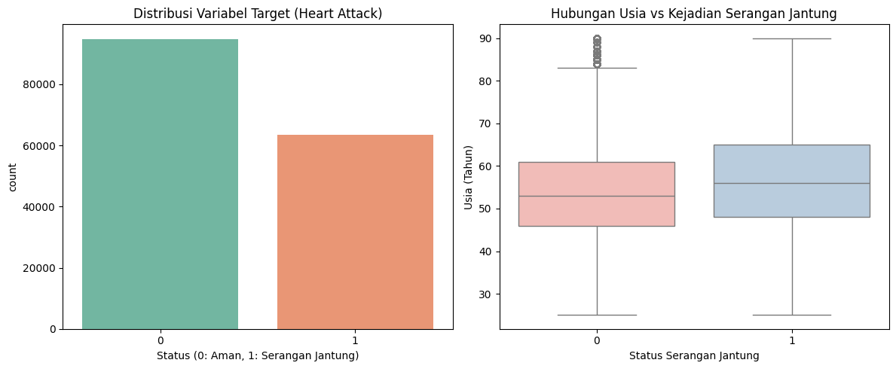
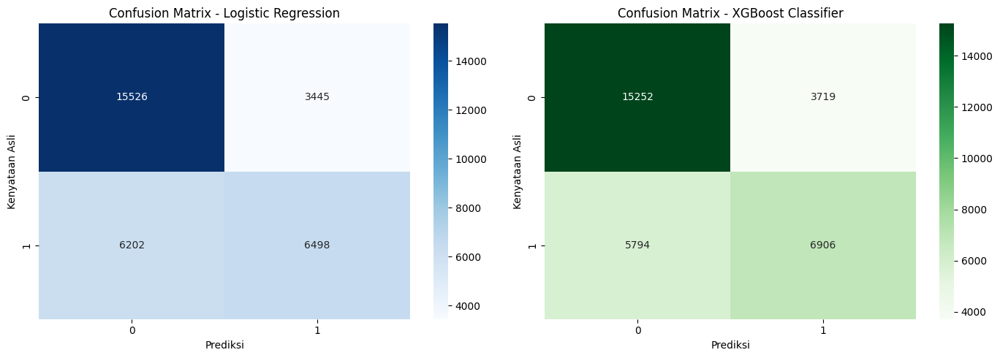

# 🩺 Laporan Proyek Machine Learning: Prediksi Risiko Serangan Jantung
[](https://colab.research.google.com/github/SalsabilaAnggraina/prediksi_serjan/blob/main/PrediksiSerJan.ipynb)

* **Metodologi Penelitian:** CRISP-DM (*Cross-Industry Standard Process for Data Mining*) 📊
* **Penyusun:** [Suci Oktavia Ramadhani & Salsabila Anggraina Putri] 👥
* **Tautan Aplikasi Interaktif (Hugging Face Spaces):** [🔗 Akses Demo Aplikasi di Sini](https://huggingface.co/spaces/saggrain/prediksi-SerJan) 🚀

---

## 📌 1. Project Overview
Penyakit kardiovaskular, khususnya serangan jantung, tetap menjadi salah satu penyebab utama mortalitas tertinggi di Indonesia. Sifat gejalanya yang acap kali asimtomatik (*silent killer*) diperparah oleh banyaknya faktor risiko multidimensional yang saling berkorelasi, mencakup aspek demografi, kondisi klinis, hingga pola hidup pasien. 💔

Proyek ini dicanangkan untuk membangun sebuah sistem komputasi cerdas berbasis *Machine Learning* yang mampu memprediksi tingkat risiko serangan jantung pada masyarakat secara dini. Implementasi ini diharapkan dapat menjadi instrumen skrining preventif bagi tenaga medis maupun masyarakat umum. 🩺✨

---

## 🎯 2. Business Understanding

### ❓ Problem Statements
1. Bagaimana karakteristik demografi serta parameter klinis harian dapat memengaruhi kecenderungan risiko serangan jantung seseorang? 📊
2. Apakah implementasi algoritma *Advanced Ensemble Learning* (**XGBoost Classifier**) mampu menghasilkan performa klasifikasi yang lebih superior dan adaptif dibandingkan model standar (**Logistic Regression**)? 🧠

### 🚀 Goals
1. Mengidentifikasi dan menganalisis korelasi prediktif dari berbagai fitur kesehatan terhadap indikasi risiko penyakit jantung. 🔍
2. Mengembangkan model prediktif dengan tingkat sensitivitas (**Recall**) yang optimal demi meminimalisir persentase kegagalan diagnosis fatal (*False Negative*). 🎯

### 💡 Solution Statement
* **Model Baseline:** *Logistic Regression* diterapkan sebagai model komparasi standar yang memiliki keunggulan dalam hal interpretabilitas koefisien statistik. 📉
* **Model Advanced:** *XGBoost Classifier* digunakan sebagai representasi algoritma mutakhir berbasis *Gradient Boosting* untuk menangani kompleksitas hubungan non-linear antar variabel. ⚡

---

## 📊 3. Data Understanding
Eksperimen ini memanfaatkan dataset rekam medis masyarakat Indonesia dari [Kaggle](https://www.kaggle.com/datasets/ankushpanday2/heart-attack-prediction-in-indonesia) (`heart_attack_prediction_indonesia.csv`) yang mencakup parameter klinis, demografi, dan psikologis. 🗂️

### 🔍 Glosarium Fitur Dataset

| Fitur | Deskripsi |
|---|---|
| 🧓 `age` | Usia biologis pasien (Fitur Numerik) |
| ⚧ `gender` | Jenis kelamin pasien (Kategorikal: Male, Female) |
| 🩸 `hypertension` | Riwayat klinis tekanan darah tinggi (Biner: 0 = Tidak, 1 = Ya) |
| 🍬 `diabetes` | Riwayat penyakit diabetes melitus (Biner: 0 = Tidak, 1 = Ya) |
| 🍟 `cholesterol_level` | Kadar kolesterol total dalam darah (Fitur Numerik/mg/dL) |
| 🍔 `obesity` | Status indeks massa tubuh berlebih/obesitas (Biner: 0 = Tidak, 1 = Ya) |
| 🚬 `smoking_status` | Kebiasaan konsumsi rokok (Kategorikal: Never, Past, Current) |
| 🥦 `dietary_habits` | Penilaian pola konsumsi makanan harian (Kategorikal: Healthy, Unhealthy) |
| 🤯 `stress_level` | Indikator skala beban psikologis internal (Ordinal: Skala 1-10) |
| 🎯 `heart_attack` | **Variabel Target** (Biner: 0 = Risiko Rendah, 1 = Risiko Tinggi) |

### ▶️ Install dan Import Libraries

```python
import pandas as pd
import numpy as np
import matplotlib.pyplot as plt
import seaborn as sns
from IPython.display import Image, display
```

### ▶️ Load Dataset

```python
# Membaca file dataset
from google.colab import drive
drive.mount('/content/drive/')
df = pd.read_csv('/content/drive/MyDrive/ML/heart_attack_prediction_indonesia.csv')

print("=== DIMENSI DATA ===")
print(f"Jumlah baris: {df.shape[0]}, Jumlah kolom: {df.shape[1]}\n")

print("=== INFORMASI DATASET ===")
df.info()
```

---

## 🛠️ 4. Data Preparation
Untuk menjamin integritas data sebelum memasuki fase pelatihan (*training*), serangkaian tahap rekayasa data berikut telah diterapkan: 🏗️

1. **Label Encoding 🧙‍♂️:** Melakukan konversi otomatis pada fitur-fitur kategorikal bertipe teks menjadi representasi numerik agar dapat diproses oleh algoritma.
2. **Feature Selection 🎯:** Membatasi variabel prediktor dengan hanya memilih 9 fitur utama yang memiliki signifikansi klinis berdasarkan fokus studi penelitian.
3. **Train-Test Split ✂️:** Membagi data secara acak menggunakan proporsi **80% Data Latih** dan **20% Data Uji** dengan menyematkan parameter `stratify` guna menjaga kestabilan distribusi label target.
4. **Feature Scaling 📏:** Menerapkan `StandardScaler` untuk menyamakan skala varians pada fitur numerik berjangkauan luas (seperti kolesterol) agar tidak mendominasi proses pembaruan bobot (*weight*) model.

### ▶️ Visualisasi EDA — Distribusi Target & Hubungan Usia

```python
# 1. Visualisasi Distribusi Target
plt.figure(figsize=(12, 5))
plt.subplot(1, 2, 1)
sns.countplot(x='heart_attack', data=df, palette='Set2')
plt.title('Distribusi Variabel Target (Heart Attack)')
plt.xlabel('Status (0: Aman, 1: Serangan Jantung)')

# 2. Visualisasi Hubungan Usia dengan Serangan Jantung
plt.subplot(1, 2, 2)
sns.boxplot(x='heart_attack', y='age', data=df, palette='Pastel1')
plt.title('Hubungan Usia vs Kejadian Serangan Jantung')
plt.xlabel('Status Serangan Jantung')
plt.ylabel('Usia (Tahun)')

plt.tight_layout()
plt.show()
```



### ▶️ Eksekusi Data Preparation

```python
from sklearn.model_selection import train_test_split
from sklearn.preprocessing import LabelEncoder, StandardScaler

df_prepared = df.copy()

# 1. Label Encoding otomatis untuk kolom teks
le = LabelEncoder()
for col in df_prepared.columns:
    if df_prepared[col].dtype == 'object':
        df_prepared[col] = le.fit_transform(df_prepared[col].astype(str))

# 2. Pemilihan Fitur
fitur_pilihan = ['age', 'gender', 'hypertension', 'diabetes', 'cholesterol_level',
                 'obesity', 'smoking_status', 'dietary_habits', 'stress_level']

X = df_prepared[fitur_pilihan].fillna(0)
y = df_prepared['heart_attack']

# 3. Train-Test Split
X_train, X_test, y_train, y_test = train_test_split(X, y, test_size=0.2, random_state=42, stratify=y)

# 4. Feature Scaling
scaler = StandardScaler()
X_train_scaled = scaler.fit_transform(X_train)
X_test_scaled = scaler.transform(X_test)

print("✅ Proses Data Preparation Selesai Sukses!")
print(f"X_train shape: {X_train_scaled.shape} | X_test shape: {X_test_scaled.shape}")
```

---

## 🤖 5. Modeling
Tahap permodelan mengevaluasi dan mengonfrontasi dua pendekatan arsitektur klasifikasi yang berbeda: ⚔️

* **Logistic Regression:** Algoritma parametrik yang memetakan kombinasi linear dari fitur input ke dalam fungsi sigmoid untuk menghasilkan output probabilitas. 📉
* **XGBoost Classifier:** Algoritma berbasis *ensemble decision trees* sekuensial yang menerapkan regularisasi formal dan minimalisasi fungsi kerugian (*loss function*) secara presisi guna mereduksi *overfitting*. ⚡

### ▶️ Training Model

```python
from sklearn.linear_model import LogisticRegression
from xgboost import XGBClassifier

# Inisialisasi model
model_lr = LogisticRegression(random_state=42)
model_xgb = XGBClassifier(random_state=42, eval_metric='logloss')

# Proses pelatihan
model_lr.fit(X_train_scaled, y_train)
model_xgb.fit(X_train_scaled, y_train)

print("✅ Model Logistic Regression dan XGBoost Classifier berhasil dilatih!")
```

---

## 🏆 6. Evaluation
Pengujian performa model dilakukan secara objektif menggunakan data uji yang belum pernah dilihat sebelumnya selama fase pelatihan. Mengingat domain penelitian berada pada sektor medis, metrik **Recall** menjadi prioritas evaluasi utama. 📊🔬

### 📊 Hasil Performa Model

| Metrik Evaluasi | Logistic Regression (Baseline) 📉 | XGBoost Classifier (Advanced) ⚡ |
| :--- | :---: | :---: |
| **Akurasi Global** | 0.70 (70%) | **0.70 (70%)** |
| **Precision (Kelas 1)** | 0.65 | **0.65** |
| **Recall (Sensitivitas Kelas 1)** | 0.51 | **0.54** |
| **F1-Score (Kelas 1)** | 0.57 | **0.59** |

**Kesimpulan Analisis:**
Meskipun kedua model menghasilkan nilai akurasi global yang sama yaitu **70%**, **XGBoost Classifier** terbukti lebih unggul dalam aspek **Recall** untuk kelas berisiko tinggi (Kelas 1), yaitu sebesar **0.54** dibandingkan Logistic Regression yang hanya **0.51**. Dalam konteks medis, peningkatan nilai *Recall* ini sangat krusial karena berhasil mereduksi jumlah pasien berisiko yang salah terprediksi sebagai pasien sehat (*False Negative*). Oleh karena itu, XGBoost dipilih sebagai model akhir untuk tahap *deployment*. 🎉

### ▶️ Classification Report & Confusion Matrix

```python
from sklearn.metrics import classification_report, confusion_matrix

# Prediksi data uji
y_pred_lr = model_lr.predict(X_test_scaled)
y_pred_xgb = model_xgb.predict(X_test_scaled)

print("=================== REPORT LOGISTIC REGRESSION ===================")
print(classification_report(y_test, y_pred_lr))

print("\n==================== REPORT XGBOOST CLASSIFIER ===================")
print(classification_report(y_test, y_pred_xgb))

# Visualisasi Heatmap Confusion Matrix Berdampingan
fig, ax = plt.subplots(1, 2, figsize=(14, 5))
sns.heatmap(confusion_matrix(y_test, y_pred_lr), annot=True, fmt='d', cmap='Blues', ax=ax[0])
ax[0].set_title('Confusion Matrix - Logistic Regression')
ax[0].set_xlabel('Prediksi')
ax[0].set_ylabel('Kenyataan Asli')

sns.heatmap(confusion_matrix(y_test, y_pred_xgb), annot=True, fmt='d', cmap='Greens', ax=ax[1])
ax[1].set_title('Confusion Matrix - XGBoost Classifier')
ax[1].set_xlabel('Prediksi')
ax[1].set_ylabel('Kenyataan Asli')

plt.tight_layout()
plt.show()
```



---

## 🚀 7. Deployment
Model terbaik (**XGBoost**) beserta objek **StandardScaler** diekspor ke dalam berkas biner `.pkl` memanfaatkan pustaka `joblib`. 📦

Sistem dideploy secara publik pada platform cloud **Hugging Face Spaces** dengan menggunakan framework antarmuka **Gradio**. Aplikasi dirancang dengan panel kendali interaktif seperti *sliders* dan *dropdown selection*, memungkinkan praktisi medis untuk memasukkan indikator klinis pasien baru dan mendapatkan kalkulasi probabilitas risiko secara *real-time*. ⚙️🌐

### ▶️ Simpan dan Download Model

```python
import joblib
from google.colab import files

# Simpan model dan scaler
joblib.dump(model_xgb, 'model_SerJan_xgb.pkl')
joblib.dump(scaler, 'scaler.pkl')

print("✅ Berhasil membuat file .pkl!")

# Download ke komputer
print("⬇️ Memulai pengunduhan file ke komputer...")
files.download('model_SerJan_xgb.pkl')
files.download('scaler.pkl')
```

👉 **[Buka Aplikasi Demo Prediksi Risiko Serangan Jantung](https://huggingface.co/spaces/saggrain/prediksi-SerJan)** 👈

---
